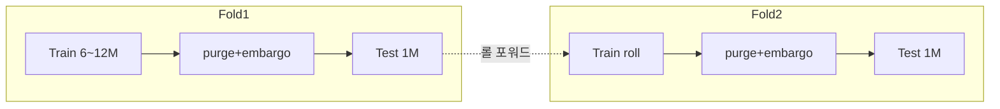
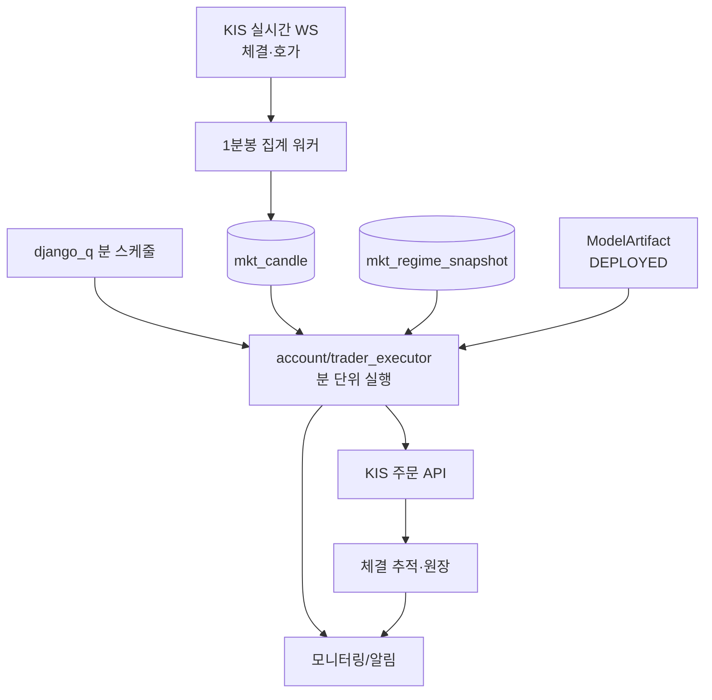

# AI 단타 시스템 설계 (1분봉 · KOSPI200)

본 문서는 종목 유니버스(기본 KOSPI200, 설정으로 교체 가능)를 대상으로 한 **1분봉 기반 AI 초단기 매매 시스템**의 설계 및 구현 방법을 정의한다.
기존 `golden_age` Django 프로젝트 구조에 통합하는 것을 전제로 하며, **거래비용·슬리피지·한국시장 제약을 반영한 현실적 검증**을 최우선 원칙으로 삼는다.

> [!WARNING]
> **현실 인식**: 1분봉 단타는 신호 엣지(edge)가 작고 거래비용이 지배적이다. 아래 4번(비용 모델)에서 보듯 **왕복 비용 ≈ 0.18~0.25%** 이므로, 모델이 발굴해야 할 순엣지는 이 값을 초과해야 한다. "장기간 안정적 수익"은 목표이지 보장이 아니며, 설계의 대부분은 *과최적화 방지 · 비용 정직 반영 · OOS 붕괴 조기 탐지*에 집중된다.

---

## 0. 시스템 개요와 기존 구조 매핑

### 0.1 파이프라인 개요 (분 단위 루프)

```mermaid
flowchart LR
    A[실시간 체결/호가<br/>KIS WebSocket] --> B[1분봉 집계<br/>mkt_candle]
    B --> C[Feature 계산<br/>mkt_feature_snapshot]
    C --> D[시장 레짐 판단<br/>mkt_regime_snapshot]
    D --> E[후보 종목 필터링<br/>Universe→Candidates]
    E --> F[LightGBM 추론<br/>trd_ml_output_log]
    F --> G[Strategy Score + ML Filter<br/>trd_strategy_decision_log]
    G --> H[리스크 체크 · 포지션 사이징]
    H --> I[주문 집행<br/>ord_order → KIS]
    I --> J[체결/원장 반영<br/>ord_trade_execution, acc_*_ledger]
    J --> K[모니터링 · PnL 귀속]
```



### 0.2 기존 코드 자산 매핑

| 설계 컴포넌트 | 기존 자산 | 확장/신규 |
| --- | --- | --- |
| 1분봉 저장 | `mkt_candle` (timeframe `1m`) | 실시간 집계기 신규 |
| Feature | `mkt_feature_snapshot` | `core/features/` 신규 |
| 시장 레짐 | `core/analyzer/market_analyzer.py`, `mkt_regime_snapshot` | 지수 레짐(HMM) 확장 |
| 후보 필터 | (없음) | `core/universe/` 신규 |
| ML 추론 | `core/ml/filter.py` (현재 Mock) | 실 LightGBM Predictor로 교체 |
| 모델 산출물 | `sys_model_artifact`, `sys_model_deployment` | 학습 파이프라인 연동 |
| 학습 데이터 | `sys_training_dataset(_item)` | `core/ml/training/` 신규 |
| 전략 신호 | `strategies/<dev>/`, `StrategyRunner` | 유지 (rule 신호원) |
| 실행 파이프라인 | `core/pipeline/{account,trader}_executor.py` | 분 단위 · 1분봉으로 확장 |
| 리스크/사이징 | `Trader.*_ratio` 필드 | `core/risk/` 신규 |
| 백테스트 | (없음) | `core/backtest/` + `BacktestBroker` 신규 |
| Broker 추상화 | `core/broker/interfaces.py` | `BacktestBroker` 구현 추가 |
| 스케줄러 | `django_q` (Q_CLUSTER) | 분봉 스케줄 등록 |

**설계 원칙**: 리서치(벡터라이즈 백테스트)와 실거래(이벤트 드리븐)가 **동일한 Feature/의사결정 코드**를 공유하도록 `core/`에 순수 함수로 분리한다. Broker만 `LiveBroker` ↔ `BacktestBroker`로 교체하여 백테스트-실거래 일관성(train/serve skew 최소화)을 확보한다.

---

## 1. 시장 레짐 판단 (Market Regime)

목적: **언제 거래할지**를 지수 레벨에서 게이팅한다. 개별 종목 신호보다 상위에서 리스크 예산과 임계치를 조절.

### 1.1 입력 (KOSPI200 지수 / KODEX200 대용)
- 추세: 지수 EMA(20/60/120) 기울기, ADX
- 변동성: VKOSPI(변동성지수), 실현변동성(RV, 1분 로그수익 30/60분 롤링), Parkinson RV
- 폭(breadth): 유니버스 내 상승 종목 비율, 신고가-신저가 스프레드
- 유동성: 지수 거래대금 z-score, 스프레드 대용

### 1.2 레짐 정의 (2축)
- **추세축**: `BULL / SIDEWAYS / BEAR`
- **변동성축**: `LOW / NORMAL / HIGH / CHAOS`
- 조합으로 6~8개 운영 레짐. `CHAOS`(급변) 또는 시스템 이벤트 시 **신규 진입 중단(kill-switch)**.

### 1.3 방법
- **1차(MVP)**: 규칙 기반 분위수 컷(예: RV 상위 10% → HIGH). 재현·해석 용이. → 기존 `market_analyzer.analyze_regime` 확장.
- **2차**: Gaussian **HMM**(hmmlearn) 또는 KMeans 클러스터링으로 잠복 레짐 추정. 라벨은 사후 특성으로 매핑.
- 산출물은 `mkt_regime_snapshot`(regime, confidence_score, parameter_payload)로 저장. `parameter_payload`에 하위 트레이더로 전달할 배수(진입임계 offset, 사이징 배수, 손절 배수)를 담아 **기존 trader_executor의 regime 튜닝 로직을 그대로 재사용**.

**게이팅 예**: `HIGH/CHAOS` → 사이징 0.5×, 진입임계 +0.1, 신규 진입 종목 수 상한 축소. `BEAR` + long-only → 매수 신호 강도 하향.

---

## 2. 후보 종목 필터링 (Universe → Candidates)

목적: 200종목 전량을 매 분 추론하지 않고, **거래 가능·유동적·엣지 기대** 종목으로 축소.

### 2.1 정적 유니버스
- KOSPI200 구성종목(리밸런싱 반영). **생존편향 방지**: 과거 구성종목 이력을 시점별로 저장(point-in-time membership)해야 백테스트가 정직해진다. → `stk_stock` + 신규 `stk_universe_membership(effective_at)` 권장.
- 제외: 관리종목/투자경고·위험, 거래정지, 신규상장 N일 이내.

### 2.2 동적(분 단위) 필터
| 기준 | 컷 예시 | 근거 |
| --- | --- | --- |
| 유동성 | 당일 누적 거래대금 ≥ X억, 최근 5분 평균 1분 거래대금 ≥ Y | 체결 가능성·슬리피지 |
| 스프레드 | (매도1호가-매수1호가)/중간가 ≤ Z bp | 비용 |
| 상태 | VI 발동/단일가/상·하한 근접 제외 | 체결 왜곡 |
| 변동성 밴드 | RV가 거래 가능 밴드 내(너무 낮음=엣지無, 너무 높음=위험) | 신호 유효성 |
| 시간대 | 09:00~09:05, 15:15~ 이후 신규 진입 제한 | 개장 변동성·종가 단일가 |

### 2.3 랭킹·상한
- 남은 후보를 `기대엣지 / 비용` 또는 모델 확률로 정렬 → **동시 후보 top-K**만 추론/보유(예: K=10~20). 계산량·집중위험 관리.
- 구현: `core/universe/filter.py` → `select_candidates(regime, snapshot_time) -> list[Stock]`. 결과를 `trd_execution_run`의 대상으로 사용.

---

## 3. Feature Engineering

원칙: **누설(look-ahead) 금지** — 시각 `t` 봉 종가까지의 정보만 사용, 실행은 `t+1`. 모든 Feature는 `mkt_feature_snapshot.feature_payload`(JSONB)에 재현 가능하게 저장.

### 3.1 Feature 그룹 (1분봉 파생)
1. **수익률/모멘텀**: 로그수익 `r(1,3,5,15,30,60m)`, 누적수익, MACD, RSI, Aroon, ROC
2. **변동성**: 롤링 std, ATR, Parkinson/Garman-Klass RV, 상하 range 비율
3. **평균회귀**: 장중 VWAP 대비 z-score, Bollinger %b, 이격도
4. **거래량/자금**: 거래량 z-score, **동일 시간대 대비 상대거래량(RVOL)**, OBV, 거래대금, 체결강도
5. **미시구조**: 캔들 몸통/꼬리 비율, 갭, (L2 가능 시) **호가잔량 불균형(OBI)**, 스프레드 — KIS는 10호가 제공
6. **시간**: 개장 후 경과분, 시간대 버킷, 요일, 개장/마감 근접 플래그
7. **횡단면(cross-sectional)**: 같은 분에서 유니버스 내 수익률 랭크/분위, 섹터 상대강도, 지수 대비 초과수익(잔차 `r_stock - β·r_index`)
8. **레짐 컨텍스트**: 1번 산출 지수 Feature를 종목 Feature에 조인

### 3.2 정규화·처리
- 횡단면 표준화(매 분 cross-sectional z-score/rank)로 종목 간 스케일 차이 제거 → **단일 pooled 모델**이 200종목을 함께 학습 가능.
- 결측/휴장/거래정지 구간 마스킹. 극단치 winsorize.
- 구현: `core/features/builder.py::build_features(stock, candles, index_ctx, regime) -> dict`. 실거래·백테스트·학습이 **모두 이 함수 하나**를 호출(스큐 방지).

### 3.3 라벨 설계 (핵심)
- **Triple-Barrier (López de Prado)**: 진입 후보 시각마다 (익절 배리어 `+u·σ`, 손절 배리어 `-d·σ`, 시간 배리어 `H분`) 중 **먼저 닿는 배리어**로 라벨.
- **비용 인지 라벨**: 순수익 = 배리어 수익 − 왕복비용. 순수익이 임계 초과일 때만 positive → 모델이 "비용을 이기는" 신호만 학습.
- **메타라벨링**: 1차 신호(진입 여부) → 2차 모델이 P(성공) 추정 → **사이징에 사용**.
- 라벨 겹침(overlapping) 존재 → **sample uniqueness 가중치** 부여, CV는 purge+embargo(5번).

---

## 4. 거래비용·슬리피지 모델 (검증 정직성의 핵심)

> 이 모델이 백테스트의 신뢰도를 결정한다. **낙관적 비용 = 허구의 수익.**

### 4.1 명시적 비용 (한국시장, 연도별 변동 주의)
- **매도 세금(증권거래세+농특세)**: 근사 **0.15~0.18%** (연도/시장별 상이, 설정값으로 관리)
- **위탁수수료**: 증권사별 약 0.0036~0.015% (양방향)
- **왕복 합계 ≈ 0.18~0.25%** — 세금이 지배적

### 4.2 슬리피지 (묵시적 비용)
- **호가단위(tick)** 반올림: 가격대별 tick(예: 5,000~20,000원→10원, 20,000~50,000→50, 50,000~200,000→100 …)
- **스프레드 비용**: 시장가 체결 시 최소 반(半)스프레드
- **시장충격**: `impact = k · σ · sqrt(주문수량 / 분당거래량)` (제곱근 충격 모델)
- **체결 슬리피지 분포**: 결정론 대신 확률적 슬리피지로 스트레스 테스트

### 4.3 체결 규칙 (look-ahead 방지)
- 시각 `t` 종가 기준 의사결정 → **`t+1` 시가 또는 `t+1` VWAP**에 슬리피지 적용 체결
- 부분체결(유동성 상한), VI/단일가/상하한 시 미체결, 지연(latency) 반영
- **종가 강제 청산**: 15:20 종가 단일가 진입 전 전량 플랫(오버나이트 금지)

구현: `core/backtest/costs.py`(비용·슬리피지 순수 함수) — 실거래 사후검증(TCA)에서도 동일 로직으로 예상 vs 실제 슬리피지 비교.

---

## 5. AI 모델 설계 (LightGBM 중심)

### 5.1 문제 정의
- **주(main)**: 이진분류 `P(익절 배리어 우선 도달 | 비용차감)` 또는 3-클래스(BUY/HOLD/AVOID)
- **보조(meta)**: 메타라벨 `P(1차신호 성공)` → 사이징
- 회귀(순 forward return) 버전도 병행 가능하나, **확률+임계치+사이징** 조합이 비용 관리에 유리

### 5.2 LightGBM 구성
- 트리 부스팅(범주형·비선형·결측 강건). `objective=binary`, `metric=auc,binary_logloss`
- **불균형/가중치**: `scale_pos_weight` 또는 sample weight(수익크기 × uniqueness)
- 정규화: `num_leaves`, `min_child_samples`, `feature_fraction`, `bagging_fraction`, `lambda_l1/l2`, `max_depth` — **과최적화 억제 우선**(작은 num_leaves, 큰 min_child_samples)
- **모델 구조**: 단일 pooled(횡단면 정규화 + 섹터/종목 엔티티 Feature). 데이터 충분 시 섹터별 분리 또는 종목 임베딩.
- **확률 보정(calibration)**: isotonic/Platt — 임계치·사이징이 확률에 의존하므로 필수
- 해석/모니터링: SHAP, feature importance, **PSI로 Feature 드리프트 감시**

### 5.3 재현성·산출물
- 학습 dataset = `sys_training_dataset(_item)`(feature_snapshot + 실현결과). Dataset은 불변.
- 모델 파일은 스토리지, 메타데이터·지표는 `sys_model_artifact`(version, metrics_payload, status). 배포는 `sys_model_deployment`.
- `core/ml/filter.py`의 현재 Mock Predictor를 **`ModelArtifact.artifact_uri`에서 LightGBM 로드**하는 실 구현으로 교체(인터페이스 유지 → trader_executor 변경 최소).

---

## 6. Walk-Forward Validation

목적: **미래 데이터 누설 없이** 재학습-검증을 시간순으로 반복하여 OOS 안정성 측정.



- **Anchored/Rolling walk-forward**: 학습창(6~12개월 1분봉) → 검증 → OOS 테스트월 → 전진. 재학습 주기 주간/월간.
- **누설 차단**: 라벨 시간창(H) 만큼 train/test 사이 **purge + embargo**. 겹침 라벨엔 **Purged/Combinatorial CV**.
- **평가지표(통계+경제 동시)**: AUC/logloss 뿐 아니라 **순PnL, Sharpe/Sortino, 적중률, 손익비, 회전율, 비용드래그, MDD, 레짐별 성과**.
- **과최적화 진단**: **PBO(백테스트 과최적화 확률)**, **Deflated Sharpe Ratio**, 폴드 간 성과 분산. 하이퍼파라미터 탐색은 좁게(nested CV).
- 구현: `python manage.py wfv --start ... --end ...` 관리 커맨드가 폴드별 학습→`ModelArtifact` 기록→OOS 백테스트→리포트.

---

## 7. 리스크 관리

계층적 방어(거래 → 종목 → 포트폴리오 → 시스템).

- **거래 단위**: ATR 기반 손절/익절, **시간 손절**(H분 내 미충족 청산), 종가 강제 플랫
- **종목 단위**: 종목당 최대 비중, 연속 손실 시 해당 종목 쿨다운
- **포트폴리오**: 최대 총노출(gross), 동시 보유 종목 수 상한, 섹터 편중 상한, **일일 손실한도(kill-switch)**
- **시스템**: 레짐 `CHAOS`/데이터 지연/체결품질 저하/브로커 오류 시 신규 진입 중단·자동 플랫, 하트비트·포지션 리컨실리에이션
- 기존 `Trader.stop_loss_ratio/take_profit_ratio/max_exposure_ratio` + 신규 `core/risk/guard.py`(포트폴리오·시스템 레벨). trader_executor의 손절/익절 로직은 이미 존재 → 확장.

---

## 8. 포지션 사이징

- **신호강도 스케일링**: 보정확률 `p`의 초과엣지 `(p − p_breakeven)`에 비례. `p_breakeven`은 비용에서 역산.
- **변동성 타겟팅**: 각 포지션 위험 균등화 `size ∝ target_vol / σ_stock`.
- **프랙셔널 켈리**: `f* = edge/odds`의 0.2~0.5× (풀켈리는 과도).
- **유동성 상한**: `size ≤ min(분당거래량·α, ADV·β)` 로 슬리피지 억제.
- **메타라벨 게이팅**: 2차 모델 확률로 0/소/대 사이징.
- 최종 = `min(신호사이징, 변동성사이징, 켈리상한, 유동성상한, 종목/포트 상한)`. 구현: `core/risk/sizing.py` → `DecisionLog.position_size_ratio/target_quantity`에 반영(기존 필드 재사용).

---

## 9. 백테스트 엔진

- **이벤트 드리븐 · 1분봉**: `t` 결정 → `t+1` 체결(4.3). 리서치용 벡터라이즈 버전과 이벤트 버전을 **상호 대조**(일치해야 신뢰).
- **현실 요소**: 비용·슬리피지·부분체결·VI/상하한·지연·종가청산·point-in-time 유니버스(생존편향 제거).
- **BacktestBroker**: 기존 `core/broker/interfaces.py` 구현체로 추가 → `trader_executor`가 실거래와 **동일 코드**로 백테스트 수행.
- **산출**: 트레이드 블로터, 자본곡선, 지표, 레짐/시간대별 귀속, 비용 귀속. 재현을 위해 config·모델버전·feature snapshot 고정.
- 구현: `core/backtest/engine.py` + `python manage.py backtest --model <artifact> --from --to`.

---

## 10. 실거래 운영 구조



- **데이터**: KIS WebSocket(체결/호가) → 1분봉 집계 → `mkt_candle`. 지연·유실 감시.
- **실행 스케줄**: `django_q` 로 매 분(장중) `execute_account_run` 트리거. 트레이더당 top-K 후보 처리.
- **모델 배포**: `sys_model_deployment`로 `DEPLOYED` 아티팩트 지정. **shadow → canary(소액) → 전량**. 이전 버전 롤백 경로 유지.
- **안전장치**: 주문 idempotency, 브로커 포지션 리컨실, 종가 자동 플랫, 연결 끊김 시 방어.
- **모니터링/TCA**: 실거래 vs 백테스트 성과 괴리, Feature 드리프트(PSI), 체결품질(예상 vs 실제 슬리피지), 지연, PnL 귀속. 임계 초과 시 자동 중단·알림.
- **검증 단계**: `PAPER` 계좌(기존 `account_type`)로 모의투자 → 소액 라이브 → 확대. (Phase 4에서 구축한 ML Filter·모의투자 흐름이 여기에 직접 연결됨.)

---

## 11. 단계별 구현 로드맵

| 단계 | 산출물 | 검증 기준 |
| --- | --- | --- |
| **P5-1 데이터 기반** | 1분봉 실시간 집계, point-in-time 유니버스, 비용/슬리피지 모델 | 1분봉 무결성, 비용 모델 단위테스트 |
| **P5-2 Feature/라벨** | `core/features/builder`, triple-barrier 라벨, `sys_training_dataset` 빌더 | 누설 테스트(train/serve 동일 함수), 재현성 |
| **P5-3 백테스트 엔진** | `BacktestBroker`, `core/backtest/engine`, 벡터↔이벤트 대조 | 비용 포함 자본곡선, look-ahead 회귀테스트 |
| **P5-4 모델/WFV** | LightGBM 학습, 보정, `wfv` 커맨드, PBO/DSR 리포트 | OOS Sharpe·MDD·PBO 임계 통과 |
| **P5-5 ML Filter 실구현** | Mock → 실 Predictor(`ModelArtifact` 로드) | 기존 pipeline 회귀테스트 통과 |
| **P5-6 리스크/사이징** | `core/risk/{guard,sizing}` | 킬스위치·한도 시나리오 테스트 |
| **P5-7 실거래 운영** | 분 스케줄, 배포/모니터링/TCA, PAPER→라이브 | 모의투자 성과 = 백테스트 근사 |

---

## 12. 핵심 리스크와 정직한 한계

- **비용 지배**: 1분봉 엣지 < 0.2%면 순손실. 비용 모델을 낙관하면 백테스트만 화려하고 실거래는 붕괴.
- **과최적화**: 방대한 Feature/하이퍼파라미터 → OOS 붕괴. WFV·PBO·DSR로 방어하되 완전 제거 불가.
- **생존편향/데이터 스누핑**: point-in-time 유니버스·purge/embargo 필수.
- **레짐 전환**: 학습 분포 밖 시장에서 성능 급락 → 레짐 게이팅·재학습·드리프트 감시로 완화.
- **long-only 제약**: 하락장 수익원 제한. 하락장에선 현금 비중 확대가 정답일 수 있음.
- **체결 현실**: 실제 슬리피지·부분체결·지연이 백테스트보다 나쁠 수 있음 → 소액 라이브로 캘리브레이션.

**결론**: 본 설계는 "확실한 수익기계"가 아니라, **비용을 정직하게 반영하고 OOS 붕괴를 빠르게 탐지·차단하는 파이프라인**이다. 기대수익은 소액 라이브 TCA로 실측한 뒤에만 확대한다.

---

# 부록 A. Phase 5 구현 현황 (P5-1 ~ P5-7)

설계를 실제 코드로 구현한 결과. 모든 항목은 테스트로 검증된다(전체 72 tests green).

| 단계 | 모듈/모델 | 비고 |
| --- | --- | --- |
| P5-1 | `core/backtest/costs.py` | KRX 호가단위·매도세/수수료·√시장충격·체결추정 |
| P5-1 | `stk_universe_membership` | point-in-time 유니버스(생존편향 제거) |
| P5-1 | `core/market/aggregator.py` | 틱→1분 OHLCV 집계 |
| P5-2 | `core/features/builder.py` | 실거래/백테스트/학습 공용 Feature (train-serve skew 제거) |
| P5-2 | `core/ml/labeling.py` | Triple-Barrier(비용차감) 라벨 |
| P5-2 | `sys_training_dataset(_item)`, `core/ml/dataset.py` | 오프라인 라벨링 데이터셋 빌더 |
| P5-3 | `core/backtest/engine.py`, `broker.py` | look-ahead 방지(t→t+1), 비용반영, MDD/승률/비용드래그 |
| P5-4 | `core/ml/validation.py` | purge/embargo Walk-Forward(모델 비의존) |
| P5-5 | `core/ml/predictor.py`, `training.py` | LightGBM 학습/추론/직렬화, `MLFilterEngine` 실모델 경로(+Mock 폴백) |
| P5-6 | `core/risk/{sizing,guard}.py` | 프랙셔널켈리·변동성타겟·유동성상한, 포트폴리오/시스템 가드 |
| P5-7 | `sys_model_deployment`, 관리 커맨드, 레짐 킬스위치 | 배포 이력·운영 진입점 |

## 운영 커맨드

```bash
# 1) 학습 데이터셋 생성 -> LightGBM 학습 -> 배포
python manage.py train_daytrading_model --symbol 005930 --model-version v1 --deploy

# 2) 계좌 단위 파이프라인 1회 실행 (분 스케줄이 호출)
python manage.py run_account_pipeline 1
```

## 분 단위 스케줄 (django_q)

장중 매 분 `run_account_pipeline`(또는 `execute_account_run`)이 실행되도록 Schedule을 등록한다.

```python
from django_q.models import Schedule
from django_q.tasks import schedule

schedule(
    "django.core.management.call_command",
    "run_account_pipeline", 1,
    schedule_type=Schedule.MINUTES, minutes=1,
    name="daytrading-account-1",
)
```

## 배포/롤백 흐름

- `train_from_dataset(..., deploy=False)` → `ModelArtifact(status=READY)`
- `deploy_artifact(artifact)` → 기존 활성 배포 자동 종료(RETIRED) + 신규 `ModelDeployment(ACTIVE)` + `artifact.status=DEPLOYED`
- `MLFilterEngine`은 `DEPLOYED` 아티팩트를 로드해 실추론, 실패 시 규칙기반 Mock으로 폴백(콜드스타트·장애 안전)

## 리스크 가드 (운영 반영)

- 레짐 킬스위치: `mkt_regime_snapshot.parameter_payload.block_new_entries=true` → 신규 BUY를 HOLD로 차단(손절/익절 SELL은 통과)
- `core/risk/guard.py`: 일일 손실 한도·동시 보유 수·종목당/총노출 상한 판정 (파이프라인 진입 직전 호출 지점 제공)

## 실운영 연결 (완료)

- **#1 실시간 수집**: `core/market/ingest.py`(`RealtimeCollector`/`MinuteBarBuffer`) → 완성분만 `mkt_candle`에 멱등 적재. 커맨드 `collect_realtime --demo`로 파이프라인 검증. (KIS WebSocket 어댑터만 실계정 연결 지점으로 남김)
- **#2 사이징 연결**: `trader_executor`가 `trader.config_payload.advanced_sizing=true`일 때 `core/risk/sizing.compute_position_size`(켈리·변동성·유동성)로 주문 수량 산정. 기본은 기존 비율(하위호환).
- **#3 정합성**: `execute_order`가 브로커 체결가/수수료/세금(`OrderResultDTO.raw_payload`)을 반영 → `BacktestBroker` 구동 시 리서치 엔진과 **동일 비용 모델(estimate_fill)**로 체결 기록. 테스트로 체결가·비용 일치 검증.

## 실운영 연결 (추가 완료)

- **다봉 재현 백테스트**: `trader_executor`에 `as_of`(미래 캔들 차단)·`broker` 주입·`candle_timeframe` 설정을 추가하고 `core/backtest/runner.py::run_trader_backtest`로 1분봉 다봉 구동. 테스트로 look-ahead 미발생(봉별 가시 캔들 수 1→N) 검증.
- **KIS WebSocket 어댑터**: `core/broker/kis/realtime.py`가 실시간 체결(H0STCNT0) 프레임을 파싱해 `RealtimeCollector`로 적재(`run(message_source)`). 파싱·수집 연결은 테스트 완료, 실 소켓 접속(`connect_and_run`)만 배포 시 연결.

## 남은 실운영 연결 작업(후속)

- KIS **실 WebSocket 접속**(`connect_and_run`): WS 라이브러리(`websocket-client` 등)와 `approval_key`(REST `/oauth2/Approval`) 발급 배선 — 네트워크/인증 필요한 미검증 I/O
- 리서치 엔진 ↔ 다봉 러너 **자본곡선 정량 대조**(TCA 리포트)
